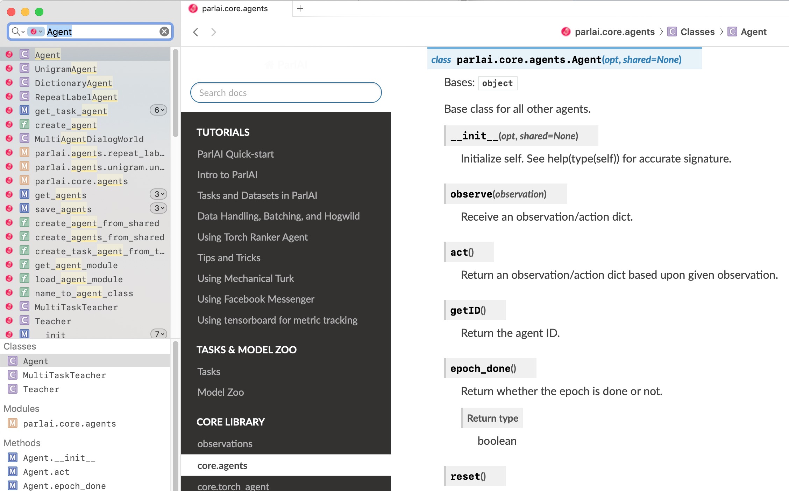

dash-docset-parlai
====================



View [ParlAI](https://parl.ai/) docs in the [dash](https://kapeli.com/dash) offline docset browser.

To use, you can add this feed in Dash:
```
https://raw.githubusercontent.com/bckim92/dash-docset-parlai/master/ParlAI.xml
```
Or download the latest release [here](https://github.com/bckim92/dash-docset-parlai/releases).

## Notes
- TODOs
  - Trim unnecessary fields
  - Automate docset generation process

## Steps to generate the docset

1. Build [ParlAI](https://parl.ai/) document with Sphinx
```
git clone git@github.com:facebookresearch/ParlAI.git
# Install dependencies, then
cd ParlAI/docs
make html
```

2. Convert html document to docset
```
doc2dash ${parlai_path}/doc/html -n ParlAI -I index.html
```

3. Set additional configurations for docset
```
# Add icons
cp icon.png ParlAI.docset/
cp icon@2x.png ParlAI.docset/Contents/Resources/Documents/

# Set online redirection
vi ParlAI.docset/Contents/Info.plist
# Add "<key>DashDocSetFallbackURL</key>" and "<string>https://parl.ai/docs/</string>"
```

## References
- [dash-docset-tensorflow](https://github.com/ppwwyyxx/dash-docset-tensorflow)
